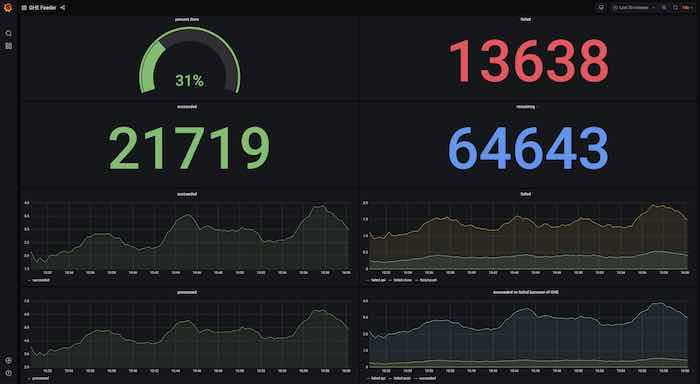

# GHE feeder tool

[GHE Feeder](https://github.com/sourcegraph/sourcegraph/tree/main/internal/cmd/ghe-feeder)

Feeds repositories into a destination GHE instance. Input are files with owner/repo strings on each line and/or
directories containing such files (see below for details about the expected input).

The https://github.com/owner/repo repositories specified on the input lines are cloned and then pushed to a destination
GHE instance. Every once in a while new orgs are created and the repos are added to those orgs.

## Usage

```shell script
ghe-feeder -admin milton -token <xxxxxxx> -scratchDir clones -numWorkers 20 -limit 100000 -baseURL https://ghe.sgdev.org/api/v3 dir1 file2 file3 dir4
```

For flag details do `ghe-feeder -help`.

## Inputs

Inputs are command line arguments consisting of files and directories. Files need to end in .json, .txt or .csv.
Directories are traversed recursively for such files.

If the input file is a .json or .txt file it expects an owner/repo string per line (and nothing else). For example:

```
"FrankBGao/try"
"NicoAN42/nav_tool"
"hcjk/AttendantTips"
"orsenthil/cpython-hg-git-test-4"
"AndreKR/one-click-hugo-cms"
"H-Len/counting-up-loop"
"PyladiesFortaleza/pyladiesfortaleza.github.io"
"vikingsc2007/VFramework"
"gitter-badger/Caelan.Frameworks.DAL"
"samma89/BabylonAuth"
"esso23/Android-wamp-client"
"jamesmartin/dotfiles"
"OatmealTokyo/hello-world"
"ernrico21/ing2"
"rto07/Checkpoint-3-Practice"
"obj1-unahur-2018s2/parcial1-turno-manana-MagaliDumit"
"BitterPepper/StoreExample"
"dnilsson1/React_Dashboard"
"direwolf-github/my-app-ec4f431a"
```

Lines can be quoted or not (quotes will be stripped).

If the input file is a .csv then owner/Repo is expected in position 6 (1-based counting) and owner is separated from repo
by the first dash. For example:

```
2019-05-23 15:22:44 -0700,4,Organization,sourcegraph,1,sourcegraph-sirupsen-logrus,public,0 Bytes,0,0,false,false
2019-05-23 15:22:47 -0700,4,Organization,sourcegraph,2,sourcegraph-inconshreveable-ngrok,public,0 Bytes,0,0,false,false
2019-05-23 15:22:47 -0700,4,Organization,sourcegraph,3,sourcegraph-spf13-cobra,public,0 Bytes,0,0,false,false
2019-05-23 15:24:11 -0700,4,Organization,sourcegraph,4,joewalnes-websocketd,public,1.01 MB,1039,0,false,false
2019-05-23 15:24:11 -0700,4,Organization,sourcegraph,5,sirupsen-logrus,public,804 KB,804,0,false,false
2019-05-23 15:24:11 -0700,4,Organization,sourcegraph,6,inconshreveable-ngrok,public,664 KB,664,0,false,false
2019-05-23 15:24:11 -0700,4,Organization,sourcegraph,7,urfave-cli,public,1.17 MB,1194,0,false,false
2019-05-23 15:24:12 -0700,4,Organization,sourcegraph,8,spf13-cobra,public,1020 KB,1015,0,false,false
2019-05-23 15:24:16 -0700,4,Organization,sourcegraph,9,tsenart-vegeta,public,1.64 MB,1683,0,false,false
2019-05-23 15:24:17 -0700,4,Organization,sourcegraph,10,gin-gonic-gin,public,1.87 MB,1917,0,false,false
2019-05-23 15:24:18 -0700,4,Organization,sourcegraph,11,FiloSottile-mkcert,public,1.74 MB,1778,0,false,false
```

The CSV files are from reports in the GHE instance which explains the field format.

## Input sources

There are several ways to get large lists of repos on github.com:

- Use a list generated by a GHE instance. Go to `/stafftools/reports` on the instance and click `Download` button for
  `All repositories`. The resulting csv can be directly used in the `ghe-feeder`.

- There are public data lakes with `github.com` repositories. For example [gharchive](https://www.gharchive.org/) and
  [ghtorrent.org](https://ghtorrent.org/).

- Google BigQuery has a list of repos available as a public dataset.

- We have a list of about 100 million repos in a company-private [GCE bucket](https://console.cloud.google.com/storage/browser/github-repo-list).
  These can also be directly used by the `ghe-feeder`.

## Resuming from previous runs and other input controls

The `ghe-feeder` command keeps track of processed ownerRepos strings in a sqlite DB
(by default called `feeder.db` in the current directory).
It records in a table called `repos` all the ownerRepos with their success or failure status and for failure the errType.
It also records the orgs it creates in an additional table called `orgs`.

The errType in the `repos` table is has these possible values:

- `api` for errors using the GHE API talking to the destination GHE (creating repos and orgs)
- `clone` for errors while cloning from github.com.
- `push` for errors doing a git push command with the destination GHE as a remote
- `unknown` for all other errors

The `feeder.db` can be used to replay and skip the already done ownerRepos. Note that it also skips ownerRepos with
errType == `clone` (the assumption is that those are either private repos for which no credentials are available or
404 for repos that got deleted since).

In addition to the `feeder.db` one can control which inputs get processed by specifying a limit on the number of lines
being processed and also by specifying how many lines to skip before starting to process. Make sure you use the same
inputs declared in the same way if you want to skip this way.

## Monitoring progress

The `ghe-feeder` command shows progress in the terminal with a progress bar,
writes into a log file (by default `feeder.log` in the current directory). In addition to that it runs a webserver and
exports metrics. By pointing a prometheus/grafana pair at it one can see progress metrics, successes vs failures etc.
The provided dashboard `ghe-feeder-dashboard.json` can imported into the grafana and used
for progress tracking.


