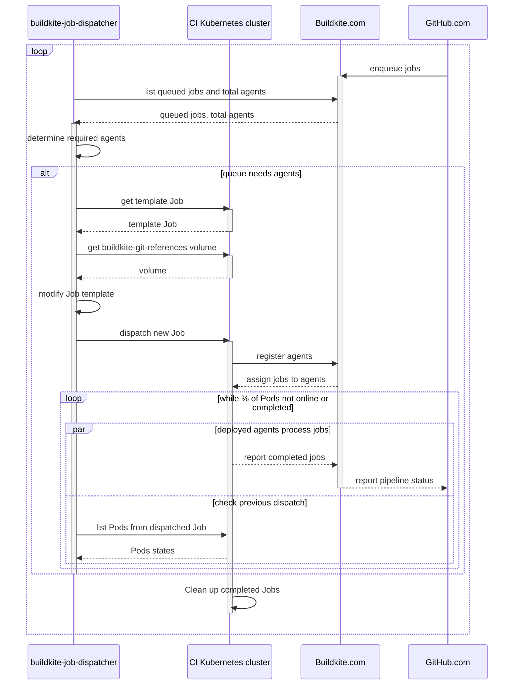

# Continuous integration infrastructure

This page consolidates resources regarding our CI _infrastucture_, namely our [Buildkite agents fleet](#buildkite-agents).
This infrastructure is maintained by the [DevInfra team](../../../../teams/devinfra/index.md).

Related resources:

- [CI playbook](../../../process/incidents/playbooks/ci.md)
- [`sourcegraph/sourcegraph` CI pipelines](https://docs.sourcegraph.com/dev/background-information/continuous_integration)
  - [`sourcegraph/sourcegraph` CI dashboard and logs](https://sourcegraph.grafana.net/d/iBBWbxFnk/ci?orgId=1)
  - [Sentry project for CI pipelines](https://sentry.io/organizations/sourcegraph/issues/?project=6110304)

## Buildkite agents

We maintain a shared fleet of Buildkite agents for continuous integration across all repositories.

- [Active agents](https://buildkite.com/organizations/sourcegraph/agents)
- [Terraform and Kubernetes manifests](https://github.com/sourcegraph/infrastructure/tree/main/buildkite)
- Images:
  - [`buildkite-agent-bazel`](https://github.com/sourcegraph/infrastructure/tree/main/docker-images/buildkite-agent-bazel)
  - [`buildkite-agent-stateless`](https://github.com/sourcegraph/infrastructure/tree/main/docker-images/buildkite-agent-stateless)
  - [`buildkite-agent-macos`](https://github.com/sourcegraph/infrastructure/tree/main/buildkite/app-macos)
  - [`buildkite-job-dispatcher`](https://sourcegraph.com/github.com/sourcegraph/infrastructure/-/tree/docker-images/buildkite-job-dispatcher)
- Specific resources:
  - [Gain access to the CI cluster](../../../process/deployments/debugging/tutorial.md#ci-cluster)
  - [CI playbook](../../../process/incidents/playbooks/ci.md)

### Buildkite agent queues

We have several different types of agents available. We recommend explicitly declaring which type of agent you want your jobs to run on with the `agents: { queue: "standard" }` field in your pipeline configuration.

The currently available queues:

- `standard`: our default Buildkite agents, which are _stateless_, currently Docker-in-Docker agents running in Kubernetes
  - Use those for any non Bazel task, as they ensure that any state leak won't affect further builds by design.
- `bazel`: our Bazel Buildkite agents, which are _stateful_, currently Docker-in-Docker agents running in Kubernetes
  - Use those for any Bazel task, as Bazel guarantees hermeticity, meaning that a given build won't affect subsequent build on the same agent.
- `macos`: a _stateful_ agent currently backed by a single host running MacOS. GCP does not provide instances which run MacOS which is why the host for this agent can be found in AWS `us-ohio-2` region.
- `vagrant`: special Buildkite agents desgined to run resource intensive test on docker deployments.

### `buildkite-job-dispatcher`

> [!NOTE] This section serves only as an intro and overview to `buildkite-job-dispatcher`. Detailed documentation and guides should go in the [CI playbook](../../../process/incidents/playbooks/ci.md) or as close to the source code as possible.

Our Buildkite agents are stateless, and are deployed in batches as Kubernetes jobs where each agent runs its workload and exits based on the size of the Buildkite backlog.
This is managed by the `buildkite-job-dispatcher`:

- [Source code](https://sourcegraph.com/github.com/sourcegraph/infrastructure/-/tree/docker-images/buildkite-job-dispatcher)
- [Documentation, dashboards, and deployment manifests](https://github.com/sourcegraph/infrastructure/blob/main/buildkite/kubernetes/buildkite-job-dispatcher)

Another potentially fragile component of this system is `buildkite-git-references`, which is a cron job and set of GCP disks that speed up pipelines by reducing the amount of cloning required.

- [Source code](https://github.com/sourcegraph/infrastructure/tree/main/buildkite/buildkite-git-references)
- [Pipeline](https://buildkite.com/sourcegraph/buildkite-git-references)

Relevant runbooks:

- [Replacing agents](../../../process/incidents/playbooks/ci.md#replacing-agents)
- [Agent availability issues](../../../process/incidents/playbooks/ci.md#agent-availability-issues)

A diagram overview of how the `buildkite-job-dispatcher` works (diagram adapted from [here](https://bobheadxi.dev/stateless-ci/#dynamic-kubernetes-jobs)):

> [!NOTE] If this diagram fails to render, [read this page on GitHub instead](https://github.com/sourcegraph/handbook/blob/main/content/departments/engineering/dev/tools/infrastructure/ci/index.md#buildkite-job-dispatcher).
