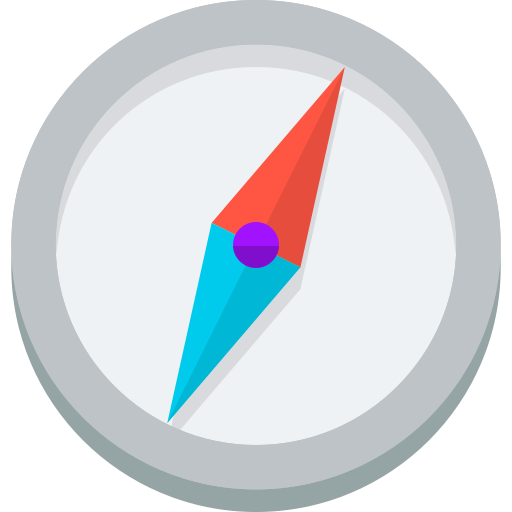

# Code Exploration team



## Links

- [Vision](../../../../strategy-goals/strategy/code-exploration/index.md)
- [GitHub Board](https://github.com/orgs/sourcegraph/projects/297/views/1)

## Mission

The Code Exploration team's mission is to make Sourcegraph the best user interface to explore and read code in the world.

## Members

{{generator:product_team.code_exploration}}

## Contact

- #code-exploration channel in Slack
- #integrations channel for integration-specific discussion
<!-- - TODO: @code-exploration-support to ping the engineer on weekly support rotation. -->
- [<span class="badge" style="background: #c2255c; color: white; font-weight: bold">team/code-exploration</span>](https://github.com/sourcegraph/sourcegraph/issues/new?labels=team/code-exploration) label on GitHub
- @sourcegraph/code-exploration team on GitHub
- code-exploration@sourcegraph.com Google group for mentioning in Google Docs and calendar invites
- [Code Exploration Events](https://calendar.google.com/calendar/u/0?cid=Y181MmU3ZmZmY2UzMWEyZjU1ZDMyOTExYjVkYmMxOTI0OTk1NzI1OWRmYjU3NWMzMmVhYTg0YzNkMTBmNWRiMWZlQGdyb3VwLmNhbGVuZGFyLmdvb2dsZS5jb20) calendar
- #code-exploration-internal for team (non-product) related discussion

## Ownership

The Code Exploration team owns the core Sourcegraph code exploration UI, which includes the following vertical areas:

- Repository routes
  - Revision selector
  - Breadcrumbs
  - Blob view
    - Hover popup
    - Sidebar
      - File tree
      - Symbols sidebar
    - Bottom panel
      - Reference panel
      - History panel
    - Actions toolbar
    - Fuzzy finder
    - Blame view
  - Repository/directory landing pages
  - Diff views
    - Compare page
    - Commit page
  - Contributors page
- [Integrations](https://docs.sourcegraph.com/integration)
  - IDE extensions
  - Browser extensions
  - Native code host integrations

We take responsibility over the following horizontal concerns:

- The navigation experience between pages and general interaction with the browser
- General performance of the webapp (e.g. how we do data fetching)
- General keyboard accessibility of the webapp (global keyboard shortcuts)
- General customizability of the webapp (e.g. theming, shortcuts)

As the largest frontend team, we also recognize our responsibility to be a steward of our web platform and the cross-team Frontend Crew.

## Processes

### Support

We run a weekly support rotation, help can be reached by tagging `@code-exploration-support` within Slack. The engineer on rotation is expected to comply with these responsibilities only **_within their usual working hours_**. There is no on-call, 24x7-watch expectation on these tasks. The async nature of Sourcegraph allows us to properly support the organization without having to be in front of the computer all day.

#### Responsibilities of the support rotation

1. Handle all incoming requests for help and questions that are directed at the `@code-exploration-support` handle or general questions in #code-exploration.
2. If the issue is deemed a P0 then the person on support must consider it their only priority to resolve. They may pull in additional team members as needed. If a P0 lasts longer than the rotation, the support person on rotation when it is raised will continue to be the DRI until the issue is resolved.
3. If the issue is not a P0 then the support person must:
   1. Work out an appropriate priority rating for the issue.
   2. Create a high quality GitHub issue (high quality being screenshots, high level investigation and description, reproducible URLs or videos of the problem). This may require communication with the person that originally raised the issue.
   3. Put the issue into the backlog to be tackled in a future iteration.
4. Communicate in the initial thread where the help was requested either notifying them of the immediate work (in the case of a P0) or a link to the created issue and an indication of when we'd tackle this.

### Weekly sync

We hold a weekly sync with notes and pre-filled agenda in our [team sync notes doc](https://docs.google.com/document/d/1teUwDotZy1qgZivPkt7ga62lzhdmNNl5_NGSrdyNl8A/edit).
Ask in #code-exploration if you'd like to make a guest appearance to discuss something!
All meetings are recorded and posted automatically to #code-exploration-internal.

### PTO

Every teammate configures their [Roots PTO Slack app](../../../../benefits-pay-perks/benefits-perks/time-off/submitting-time-off.md) to add our team calendar as an additional calendar (and disables adding their manager directly to the calendar invite) so that their PTO is visible to their team.

Calendar ID:

```
c_52e7fffce31a2f55d32911b5dbc19249957259dfb575c32eaa84c3d10f5db1fe@group.calendar.google.com
```
