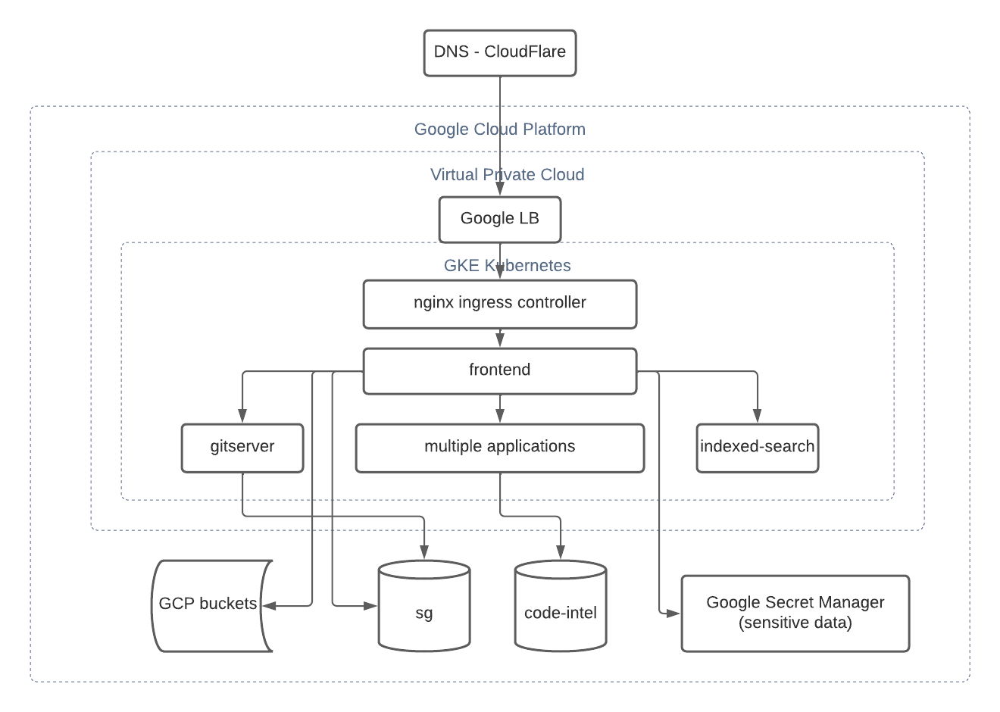

# Disaster Recovery for DotCom

Disaster Recovery process contains playbooks for different components:

- [DotCom base infrastructure](#dotcom-base-infrastructure)
- [CloudSQL databases](#databases)
  - [Database backup process](#database-backup-process)
  - [Database restore process](#database-restore-process)
- [Google Secret Manager](#google-secret-manager)
  - [Google Secret Manager backup process](#google-secret-manager-backup-process)
  - [Google Secret Manager restore process](#google-secret-manager-restore-process)
- [GKE Kubernetes](#gke-kubernetes)
  - [How to install Velero in GKE Kubernetes](#how-to-install-velero-in-gke-kubernetes)
  - [GKE Kubernetes backup process](#gke-kubernetes-backup-process)
    - [On demand backup steps](#on-demand-backup-steps)
    - [Scheduled backup steps](#scheduled-backup-steps)
  - [GKE Kubernetes restore process](#gke-kubernetes-backup-process)
  - [Update nginx ingress controller](#update-nginx-ingress-controller)
  - [Deployments are stuck and Volumes won't mount](#deployments-are-stuck-and-volumes-wont-mount)

# DotCom base infrastructure

[Sourcegraph](https://sourcegraph.com) is deployed on Google Cloud Platform.



Before restoring all components from backups, [terraform](https://k8s.sgdev.org/github.com/sourcegraph/infrastructure/-/blob/cloud/README.md) has to be applied to create:

- virtual private network with subnetworks
- CloudSQL instances with private VPC peering
- GKE Kubernetes cluster
- GCP service accounts
- Google Storage buckets

# CloudSQL databases

[Sourcegraph](https://sourcegraph.com) uses two Google CloudSQL instances:

- [main database sg](https://sourcegraph.sourcegraph.com/github.com/sourcegraph/infrastructure/-/blob/cloud/sql.tf?L39)
- [code-intel database](https://sourcegraph.sourcegraph.com/github.com/sourcegraph/infrastructure/-/blob/cloud/sql.tf?L110)

Apart from automated daily backups, Sourcegraph performs database exports to Google Storage Bucket as [recommended by Google](https://cloud.google.com/sdk/gcloud/reference/sql/export/sql).

## Database backup process

Steps to create an export of the CloudSQL database into Google Storage bucket:

1. Create Google bucket for exports:

```
gsutil mb -p sourcegraph-dev -l us gs://prod-database-export
```

2. List SQL instances:

```
gcloud sql instances list
```

3. Get service account for SQL instance:

```
gcloud sql instances describe <instance ID> | grep service
```

4. Add database instance permission to create objects in the bucket:

```
gcloud projects add-iam-policy-binding sourcegraph-dev --member=serviceAccount:p323384348006-s6zx3o@gcp-sa-cloud-sql.iam.gserviceaccount.com --role=roles/storage.objectCreator
```

5. Export the database into the bucket:

```
gcloud sql export sql --async --offload <instance ID> gs://prod-database-export/<instance ID>-$(date +%s).gz --database=sg
```

Meaning of the flags:

- `--async`: return immediately, without waiting for the operation in progress to complete
- `--offload`: offload an export to a temporary instance. Doing so reduces strain on source instances and allows other operations to be performed while the export is in progress

6. Check status of export, as with async flag, it returns immediately after invoking export command in previous point:

```
gcloud sql operations list  --instance=<instance ID> --limit=10
```

Note: Export has to be in status: `DONE`

7. Verify that the database dump was created:

```
gsutil ls gs://prod-database-export/
```

## Database restore process

1. Create a CloudSQL database instance either via the [terraform module](https://sourcegraph.sourcegraph.com/github.com/sourcegraph/infrastructure/-/blob/cloud/sql.tf?L36)

2. Create user:

```
gcloud sql users create sgdr --instance=<instance ID> --password=testdr
```

3. Create database schema:

```
gcloud sql databases create sgdr --instance=<instance ID>
```

4. Check available import files:

```
gsutil ls gs://prod-database-export/
```

5. Import file from the bucket:

```
gcloud sql import sql <instance ID> gs://prod-database-export/<backup name>.gz --database=sgdr --user=sgdr
```

6. Verify all tables are available:

- download [SQLProxy](https://cloud.google.com/sql/docs/postgres/connect-admin-proxy#install)
- start SQLProxy:

```
./cloud_sql_proxy -instances=sourcegraph-dev:us-central1:<instance ID>=tcp:0.0.0.0:5432
```

- connect to the database in another terminal tab:

```
psql "host=127.0.0.1 dbname=sgdr user=sgdr" (password: testdr)
```

- invoke commands in `psql` client

```
\c sgdr
\dt
```

Note: last command should list all available tables in the `sgdr` database.

# Google Secret Manager

All sensitive informations and files are kept and versioned in the [Google Secret Manager](https://cloud.google.com/secret-manager).
These secrets are then mounted to the applications deployed on the Google Cloud Kubernetes via [terraform modules](https://k8s.sgdev.org/github.com/sourcegraph/infrastructure/-/blob/cloud/gsm-secrets.tf).

## Google Secret Manager backup process

Steps to create backup of all existing secrets in Google Secret Manager:

1. List all existing secrets:

```
SECRETS=$(gcloud secrets list | awk '!/NAME/ {print $1}')
```

2. Iterate over secrets and make a copy of the latest version of the secret into the files:

```
for secret_name in $SECRETS; do
  VERSIONS=$(gcloud secrets versions list $secret_name --limit 1 | awk '!/NAME/ {print $1}')
  for secret_version in $VERSIONS; do
    gcloud secrets versions access $secret_version --secret=$secret_name >$secret_name
  done
done
```

## Google Secret Manager restore process

Note: Restore process iterates over files in the folder and creates Google Manager Secrets from them.

Steps to restore Google Secret Manager secrets from files in the current folder:

```
for secret_name in *; do gcloud secrets create $secret_name --data-file=$secret_name; done
```

# GKE Kubernetes

Google Kubernetes cluster is the platform for all applications. Applications are using [ConfigMaps](https://kubernetes.io/docs/concepts/configuration/configmap/), [Secrets](https://kubernetes.io/docs/concepts/configuration/secret/) and [PersistentVolumes](https://kubernetes.io/docs/concepts/storage/persistent-volumes/) to keep their configuration, state and local cache.

Sourcegraph uses open source tool [Velero](https://velero.io/) to backup and restore GKE Kubernetes cluster state and GCP disk snapshots.

## How to install Velero in GKE Kubernetes

Note: original documentation from [Velero](https://github.com/vmware-tanzu/velero-plugin-for-gcp#setup)

1. Set project:

```
gcloud config set project sourcegraph-dev
```

2. Create bucket for cluster snapshot:

```
gsutil mb gs://sg-velero-prod-backup
```

3. Export project ID:

```
PROJECT_ID=$(gcloud config get-value project)
```

4. Create ServiceAccount for Velero:

```
gcloud iam service-accounts create velero --display-name "Velero service account"
```

5. Export ServiceAccount email:

```
SERVICE_ACCOUNT_EMAIL=$(gcloud iam service-accounts list --filter="displayName:Velero service account" --format 'value(email)')
```

6. Export permissions required for GCP:

```
ROLE_PERMISSIONS=(
    compute.disks.get
    compute.disks.create
    compute.disks.createSnapshot
    compute.snapshots.get
    compute.snapshots.create
    compute.snapshots.useReadOnly
    compute.snapshots.delete
    compute.zones.get
)
```

7. Create role for velero.server:

```
gcloud iam roles create velero.server \
  --project $PROJECT_ID \
  --title "Velero Server" \
  --permissions "$(IFS=","; echo "${ROLE_PERMISSIONS[*]}")"
```

8. Connect Velero ServiceAccount with Velero server role:

```
gcloud projects add-iam-policy-binding $PROJECT_ID \
  --member serviceAccount:$SERVICE_ACCOUNT_EMAIL \
  --role projects/$PROJECT_ID/roles/velero.server
```

9. Add Velero ServiceAccount permissions to the snapshot bucket:

```
gsutil iam ch serviceAccount:$SERVICE_ACCOUNT_EMAIL:objectAdmin gs://sg-velero-prod-backup
```

10. Create Velero ServiceAccount keys needed for installation on GKE Kubernetes:

```
gcloud iam service-accounts keys create credentials-velero --iam-account $SERVICE_ACCOUNT_EMAIL
```

11. Install Velero on GKE Kubernetes:

```
velero install \
  --provider gcp \
  --plugins velero/velero-plugin-for-gcp:v1.4.0 \
  --bucket sg-velero-prod-backup \
  --secret-file ./credentials-velero \
  --velero-pod-cpu-limit=1 \
  --velero-pod-cpu-request=1 \
  --velero-pod-mem-limit=512Mi \
  --velero-pod-mem-request=512Mi \
  --pod-annotations "cluster-autoscaler.kubernetes.io/safe-to-evict"="true"
```

12. To prevent Velero from blocking cluster autoscaling, the pod should be deployed with a QoS of `Guaranteed`. To achieve this, the initContainer needs to have its resources set as well, which cannot be done with CLI flags, so patch the deployment:

```
kubectl patch deploy velero -n velero --type json -p='[
{"op": "replace", "path": "/spec/template/spec/initContainers/0/resources/requests/memory", "value":"512Mi"},
{"op": "replace", "path": "/spec/template/spec/initContainers/0/resources/limits/memory", "value":"512Mi"},
{"op": "replace", "path": "/spec/template/spec/initContainers/0/resources/requests/cpu", "value":"1"},
{"op": "replace", "path": "/spec/template/spec/initContainers/0/resources/limits/cpu", "value":"1"}]'
```

Note: installation instructions for [Velero cli](https://velero.io/docs/v1.8/basic-install/)

## GKE Kubernetes backup process

GKE Kubernetes backup process is performed by [Velero](https://github.com/vmware-tanzu/velero-plugin-for-gcp#setup) tool.

### On demand backup steps

1. Install Velero on GKE Kubernetes:

```
velero install \
 --provider gcp \
 --plugins velero/velero-plugin-for-gcp:v1.4.0 \
 --bucket sg-velero-prod-backup \
 --secret-file ./credentials-velero
```

2. Invoke manual backup with disk snapshots:

```
velero backup create sgdr<timestamp> --snapshot-volumes --wait
```

Note: wait ensures the backup is done synchronously, so any error will be reported after it finishes.

3. Verify backup is present and no errors:

```
velero backup get
```

4. Verify disk snapshots are done:

```
gcloud compute snapshots list
```

### Scheduled backup steps

1. Install Velero on GKE Kubernetes:

```
velero install \
  --provider gcp \
  --plugins velero/velero-plugin-for-gcp:v1.4.0 \
  --bucket sg-velero-prod-backup \
  --secret-file ./credentials-velero
```

2. Create scheduled backup with disk snapshots:

```
velero schedule create prod-daily --schedule="0 0 * * *" --snapshot-volumes=true
```

Note:

- daily schedules can be see by `velero schedule get`
- created backups can be seen by `velero backup get`

## GKE Kubernetes restore process

Important:

- new GKE Kubernetes cluster was created via [terraform](https://github.com/sourcegraph/infrastructure/pull/3101)
- if Velero is going to restore a snapshot in a DIFFERENT GCP project, all steps from [How to install velero in the GKE cluster](#how-to-install-velero-in-gke-kubernetes) have to be performed in the new GCP project.

1. Connect to new GKE cluster:

```
gcloud container clusters get-credentials prod-dr --region us-central1 --project sourcegraph-dev
```

2. Install Velero on GKE Kubernetes:

```
velero install \
  --provider gcp \
  --plugins velero/velero-plugin-for-gcp:v1.4.0 \
  --bucket sg-velero-prod-backup \
  --secret-file ./credentials-velero
```

3. Add backup location to Velero (required if in previous step –bucket is not the same as the bucket used to make snapshot from origin cluster):

```
velero backup-location create prod-backups --provider gcp --access-mode=ReadOnly --bucket sg-velero-prod-backup
```

4. Add disks snapshots location:

```
velero snapshot-location create prod-snapshots --provider gcp
```

5. Check available backups and choose appropriate:

```
velero backup get
```

6. Restore applications into new cluster (this will also create PV disks from GCP snapshots):

```
velero restore create prod-dr --from-backup sgdr<timestamp> --include-namespaces prod,ingress-nginx --wait
```

7. Check if restore was successful:

```
velero restore describe prod-dr
```

## Update nginx ingress controller

Note: if nginx ingress controller was also restored by Velero, please follow the steps to update it.

Fix nginx ingress controller after restore (only if restoring from running cluster):

1. Remove Google LB IP from nginx configuration (cannot use a static IP that is already in use):

```
kubectl patch svc sg-nginx-ingress-nginx-controller --type=json -p="[{'op': 'remove', 'path': '/spec/loadBalancerIP'}]" -n ingress-nginx
```

2. Login to original cluster and invoke (cluster roles are not restored by Velero):

```
kubectl get clusterroles sg-nginx-ingress-nginx -o yaml > cr_backup.yaml && kubectl get clusterrolebinding sg-nginx-ingress-nginx -o yaml > crb_backup.yaml
```

3. Login to new cluster and invoke:

```
kubectl apply -f cr_backup.yaml && kubectl apply -f crb_backup.yaml
```

4. Test Sourcegraph via public IP:

```
curl -ki https://$(kubectl get services -n ingress-nginx sg-nginx-ingress-nginx-controller --output jsonpath='{.status.loadBalancer.ingress[0].ip}')/search -H "Host: sourcegraph.com"
```

5. Change CloudFlare to point to the new IP:

```
preview.sgdev.dev -> kubectl get services -n ingress-nginx sg-nginx-ingress-nginx-controller --output jsonpath='{.status.loadBalancer.ingress[0].ip}'
```

## Deployments are stuck and Volumes won't mount

In the event that the host machines on GKE change, and the nodes are having troubles mounting the volumes listed in the [Sourcegraph.com](https://github.com/sourcegraph/deploy-sourcegraph-cloud) deployment manifests. We can manually delete the Persistent Volume Claim, the deployment files associated and manually redeploy each service. The Volumes are set to `retain` so no data will be loss, it is just in the Kubernetes abstraction layer that the claim will be deleted from, the underlying storage will be kept in GCP. If services are failing to mount volumes, proceed with the following steps:

1. Ensure Retain is set
2. Run `kubectl delete pvc $target-pvc` - This unblocks the deletion so it can proceed
3. Run `kubectl delete pod $podUsingThatPVC`

Deletion occurs, PV and PVC gets deleted BUT the underlying disk is okay because of Retain.  
The pod gets recreated but is blocked on startup because it can’t find the disk that fulfills requirement.

4. Run `kustomize build base/$pod | kubectl apply -f -`

Note: Check whether the deployment has kustomize options, if not it is sufficient to just run `kubectl apply -f .` in the directory of the desired service.

If you find that the deployment is not being rolled out, you can delete that deployment file first before re-applying.
