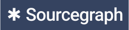
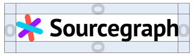
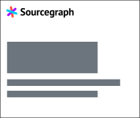
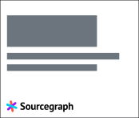
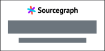
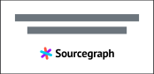

# Our logo

## Logo history

### How did we get the name _Sourcegraph_?

Our founders Quinn and Beyang opened up the Notes app and started throwing a bunch of words in it that represented code and organization. They tried words like node, graph, tree, code, etc. They decided they wanted ‘graph’ in it, as a reference to the “knowledge graph”, so they began trying many different words in front of ‘graph’ to see what fit best. Eventually they landed on Sourcegraph but the url ‘sourcegraph.com’ was already taken. Quinn contacted the owner, who was trying to get into a fellowship project at the time. Quinn got him excited about what we were doing as a company. When Quinn went to Miami for his bachelor party, he met with the owner of the dot com, and in the end the owner gave Quinn the name for free. The previous owner still stays in touch and is a very nice guy.

### How did we get our colors?

> “Lots of other software companies and developer tools were so bland and boring-looking back then (the blues and grays), including ours! We wanted it to be bright, bold, and vibrant. Interesting. Fun. Welcoming. So the agency we worked with more or less presented these as an (obviously) bright and bold palette, and we said ‘Looks good!’”
>
> <cite>— Quinn Slack, CEO</cite>

Today’s updated version of the palette, with
a nod to ADA accessibility and the inclusion of a secondary palette for more versatility in design, refers back to this approach to color.

### An iterative past

Over the years the Sourcegraph logo has taken many
forms—here is just a sample of the various sans serifs,
colors, and logomark styles.

<table class="old-logos-table" style="width: auto; margin: auto">
  <tr><td></td> <td>2013</td></tr>
  <tr><td></td> <td>2014</td></tr>
  <tr><td></td> <td>2015</td></tr>
  <tr><td></td> <td>2015</td></tr>
  <tr><td></td> <td>2017</td></tr>
  <tr><td></td> <td>2020</td></tr>
</table>

## Our logo

The Sourcegraph logomark or “Star” is inspired by the wildcard symbol (an asterisk) common
to many computer programming languages.
A wildcard is a kind of placeholder represented by a single character, such as an asterisk (\*), which can be interpreted as a number of literal characters or an empty string. It is often used in file searches so the full name need not be typed.

Since Sourcegraph’s core product and feature set is related to universal code search, this symbol ties back to our company’s founding and the contributions we’re making to software development. For further reading, see this [article on wildcard characters](https://en.wikipedia.org/wiki/Wildcard_character).

  

## Logo versions

The relationship between the logomark (the Star) and wordmark (the text) should remain consistent.

To accommodate all environments where the Sourcegraph logo may appear, we’ve created a suite of logo versions. Each version was created to serve a specific purpose and should be used accordingly.

  

    <h4>Horizontal logo</h4>
    
This is our primary logo and is for use on most backgrounds including white and gray.

    

      
    

  

  

    <h4>Logomark — the Star</h4>
    
For use within an already established context of the brand.

    

      
    

  

  

    <h4>Wordmark</h4>
    
Used sparingly: in instances where space is limited, or for creative purposes where the Star is shown separately.

    

      
    

  

  

    <h4>Reversed logo</h4>
    
The reversed logos are for use on dark backgrounds or imagery.

    

      
    

  

  

    <h4>One-color logos</h4>
    
The one-color logo should be used with backgrounds that contrast with the colors in the full-color logomark. Use black on lighter colors, white on darker. These versions should be used sparingly though, because our logo color combination is a key source of recognition for our brand.

    

      

        
        
      

      

        
        
      

    

  

## Primary logo use

### Clear Space and Minimum Size

The clear space is defined by the letter O in the wordmark. It is important to keep other elements outside of this clear space.

To ensure proper legibility the logo minimum size should not go below 0.9 inches in width for print or 30 pixels in height for digital.

  

    <h4>Clear space</h4>
    

      
    

  

  

    <h4>Minimum digital size</h4>
    

      
    

  

  

    <h4>Minimum print size</h4>
    

      
    

  

### Primary logo placement

  

        <h4>Preferred placement</h4>
        
        

            <b>Upper left corner</b>
            Typically seen as introductory.
        

  

  

    <h4>Allowable placement</h4>
    

      
      

      <b>Lower left corner</b>
      Use if upper left corner is unavailable.
    

    

      
      
      

      <b>Centered</b>
      Only when all content is centered.
    

  

### Primary logo alignment

See [PDF](https://sourcegraphstatic.com/Sourcegraph_Brand_Guidelines.pdf#page=16)

### Primary logo misuse

See [PDF](https://sourcegraphstatic.com/Sourcegraph_Brand_Guidelines.pdf#page=17)

### Logomark use

See [PDF](https://sourcegraphstatic.com/Sourcegraph_Brand_Guidelines.pdf#page=18)

### Logomark placement

See [PDF](https://sourcegraphstatic.com/Sourcegraph_Brand_Guidelines.pdf#page=19)

### Logomark misuse

See [PDF](https://sourcegraphstatic.com/Sourcegraph_Brand_Guidelines.pdf#page=20)

### Best uses for the logomark

See [PDF](https://sourcegraphstatic.com/Sourcegraph_Brand_Guidelines.pdf#page=21)

### Best uses for the one-color logo or logomark

See [PDF](https://sourcegraphstatic.com/Sourcegraph_Brand_Guidelines.pdf#page=22)

### Wordmark use

See [PDF](https://sourcegraphstatic.com/Sourcegraph_Brand_Guidelines.pdf#page=23)

## Logo usage rights

Displaying the Sourcegraph logo on your website or other digital asset is only allowed with express permission and usually governed through the vendor contract (refer to [Sourcegraph's procurement policy](../../../finance/process/ap.md#commercial-negotiations)).

Startup companies, whose product or service we use, that would like to showcase the Sourcegraph logo can request approval as long as their company conforms to the general criteria of a startup: VC-backed, pre-IPO, and under 200 people employed. Written permission can be obtained from the primary contact for the account.
