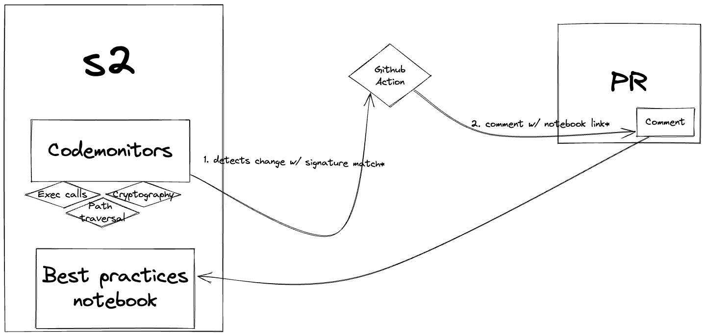

# Continuous Review Process

This document describes how the security team continuously reviews code within Sourcegraph. Not to be confused with our [formal review process](./secure-code-review.md).

## Introduction

We use code monitoring to receive alerts when we detect certain functionalities. This allows us to perform incremental code reviews that scale with the growth of the application. We also aim to make this process as effortless as possible, for both the security team and the engineers. We use automated reviews so we can create awareness about best practices and common anti-patterns. This should lead to a more robust codebase and an increased level of security.

## Sensitive interactions

Before we can proceed with writing code monitors, it is important to define what to check for.

That’s why we have defined a set of interactions that can be dangerous. Especially when a user manages to inject unsanitized data in a function call. Typical examples include interactions with:

- Operating system interfaces (e.g., filesystem, execution environment, sockets);
- External services (e.g. HTTP with user input, outgoing webhooks, gRPC);
- Cryptographic libraries (e.g. TLS, encryption or hashing of user-data).

If an attacker has (partial) control over the data that, for example, gets passed to a Golang exec call, it might lead to a command execution bug. Most of these interactions can lead to vulnerabilities as described in the [OWASP top 10](https://owasp.org/Top10/).

## Automated reviews

All the interactions call certain Go functions, for which we can write a search. We can then use code monitors to execute this search on a regular basis. When a monitor detects a new result we use a webhook to call an external service like GitHub actions.

  
  
Continuous review process.

GitHub actions then comments on a PR with information on how to use the detected functionalities in a safe way. For example: when we detect an exec call. In this case we can point to `gitserver`’s implementation: it uses an allowlist for preventing command injection attacks. If the engineer is already aware of the best practices they can ignore the comment. If they need more information they can tag the security team on GH (@sourcegraph/security-code-review).

### Code monitors

As SAST (Static Application Security Testing) tools are being used for a little while now, we can get an idea of what patterns we can use for our searches. For instance GitLab has made a Semgrep ruleset with some rules based on GoSec. There are some rules that look like search patterns, but also some rules that use taint-analysis and metavariable matching, that we cannot use (yet?). Since every codebase is different, we have also created our own rules that only apply to our codebase.

Sourcegraph has comments that include `// 🚨 SECURITY:`. This code might’ve had security issues in the past or has code with potential security risks associated with it. So when we detect changes around these comments a monitor triggers. Another example is a trigger that detects file system interactions.

### Notebooks

For every code monitor, there is a notebook with best practices that an engineer can use as a reference. We will link the notebook using a comment in the PR.

## Manual reviews

Until the automated process is in place, a security engineer will manually review the incoming alerts in a Slack channel (#security-code-monitoring). Even with the desired automation in place, we will still review certain alerts to tune the rules. This is an important step for improving our code monitors. Because code is alive and always changing we keep updating our monitors. During code reviews we discover more patterns, which end up in new code monitors.

Most day-to-day reviews are small reviews that happen in merge requests. The security team can also decide to look deeper into a new or existing feature on-demand. Engineers can also [request formal code reviews](./secure-code-review.md)

When reviewing code we look for vulnerabilities such as the ones defined by the [OWASP Top 10](https://owasp.org/Top10/). After finding a vulnerability it gets logged as an issue. This issue then ends up in the [Vulnerability Management Process](./vulnerability-management-process.md).
