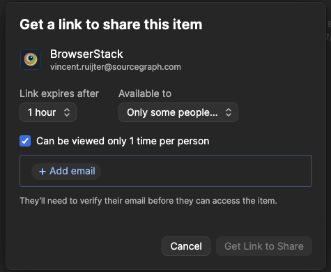

# Secret Sharing Policy

This document specifies how to distribute secrets among engineers and customers.

## Sharing password reset links

Sharing password reset links for Sourcegraph is safe! We invalidate the password reset link after setting the password (which should be the standard for all reset links). So when creating an account for a customer or teammate, it’s actually best practice to share the password reset link with them, so they can set their own password. By default the link expires after 24 hours, so if the receiver tells you that the password reset link has expired within that time frame, it might be a good idea to [alert the security team](./index.md#contact)!

## Sharing other types of credentials

Within Sourcegraph we use 1Password for managing our credentials. If you want to share credentials with a teammate you can add it to the shared Vault.

Are the credentials especially sensitive, or do you want them with someone outside of Sourcegraph? Create the credentials in your private Vault and use 1Password to create a sharing link. You can then share that link privately with someone. If only one person is expected to receive the credential, make sure to enable the option to expire the link after 1 view. We also recommend adding the email address of the recipient for extra security.

  
  
Sharing an item with 1Password

