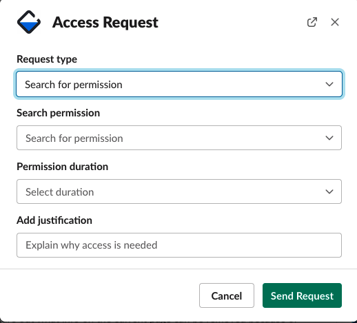
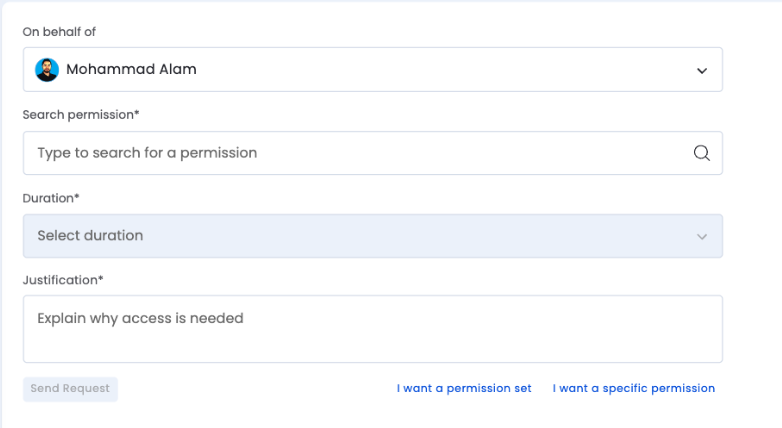
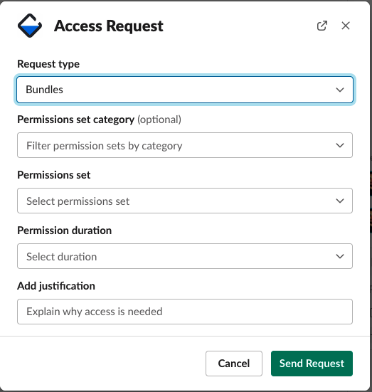
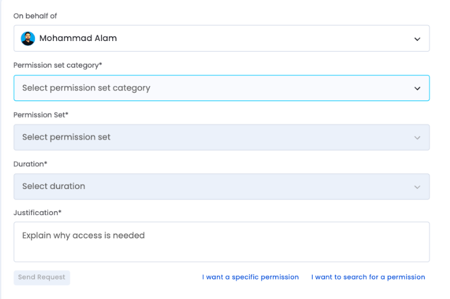
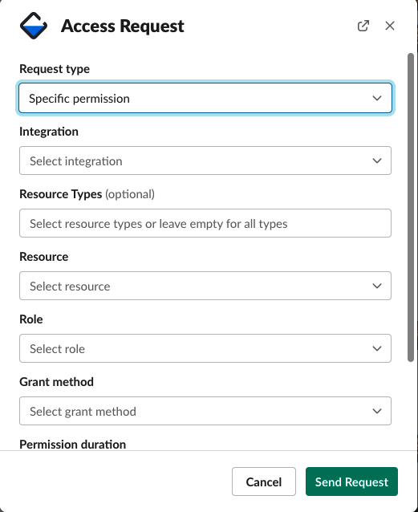
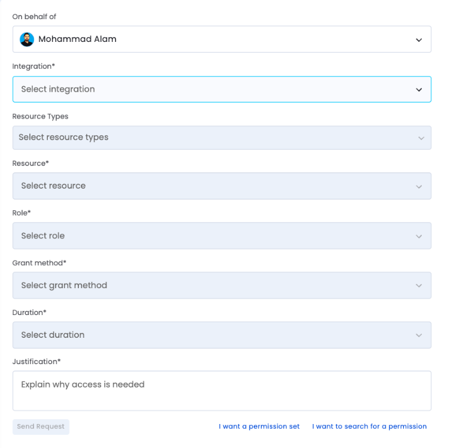

# How to request access to Google Cloud resources via Entitle:

Entitle is available through a Slack integration as well as web interface.

## Web Interface

- The webapp is available at [here](https://app.entitle.io/request)
- You can login via your Google Workspace account
- Clicking on "New Request" in the top left corner will take you to the request form
- Please see request form details below on

## Slack Interface

- Slack interface is available by typing /entitle or /access_request in any slack window

## There are three ways of requesting access via Slack or Web Interface.

- [Search for Permissions](entitle_request.md#search-for-permission-request)
- [Permission Sets](entitle_request.md#permission-sets-request)
- [Specific Permission](entitle_request.md#specific-permission-request)

## Search for Permission Request:

This request type is a search engine that will take you more directly to permission and roles that you may be looking to request.

1. Issuing slack command will show you this popup:

OR web interface form will look like this

2. Search for Permission request type is the default choice
3. “Search Permission”: This is where you would type in information regarding your request:
   1. You can type in a project name to see what Roles you can request
   2. You can type in a particular Role to see which resources you can request it on
   3. You can also combine and type in Role and Project together to narrow down your search.
4. Permission Duration: is the amount of time you will need this access for. This will ensure that once you are finished with your necessary task, the permissions are revoked to keep our systems more secure.
5. Add Justification: This is a very important step. Without proper justification for your access, your request will be denied. This is necessary for audit and reporting purposes. Please reference a customer ticket, a jira ticket, or any other relevant information that justifies your need for access to the resource.

NOTE: this feature is still in Beta so results may vary. If you do not see the expected results, please use the other two request methods.

## Permission Sets Request:

Permission Sets are Entitle’s way of grouping necessary permission together for a certain task. These are custom built based on team requests and frequency of use.
To request a custom built set, please reach out to the Security team.
To request permissions via a Bundle, follow these steps:

1. Issue /entitle or /access_request command in slack and you will see the following popup if you choose Permission Sets from Request Type dropdown

   

OR if you click "I want a permission set" on the bottom of the web interface form

2. “Permission set category” is optional but narrows your list of available Bundles. You can leave this field blank if you want to see all the available Bundles
3. “Permission Set” are custom created grouped permissions for easy request submission. These are created so that a teammate who may need access to multiple resources for a particular task can request it in one request vs submitting multiple requests. If a Permission Set describes the type of access you require, you can select it.
   1. If there isn't one that fits your need and you think that you will benefit from a custom permission set, please reach out to security team.
4. Permission Duration: is the amount of time you will need this access for. This will ensure that once you are finished with your necessary task, the permissions are revoked to keep our systems more secure.
5. Add Justification: This is a very important step. Without proper justification for your access, your request will be denied. This is necessary for audit and reporting purposes. Please reference a customer ticket, a jira ticket, or any other relevant information that justifies your need for access to the resource.

## Specific Permission Request:

This option allows for granular access requests to only necessary data/instances. \
To request permission to a specific resource follow these steps:

1. Issue /entitle or /access_request command in slack and choose Specific Permission from Request Type. you will see the following popup

   

OR if you click "I want a specific permission" on the bottom of the web interface form

2. Next you will choose the integration you need access to. Based on your team and division, you will see specific options. In this guide we will focus on GCP. You have two options
   1. GCP Development Projects: All projects not containing customer data
   2. GCP Production Projects: Customer Instances and other production level projects
3. Resource Type: This is a list of resource types available for the integration chosen. In case of GCP, you will see options such as “projects”, “instances”, “buckets” as well as other options. This drop down is optional but allows you to narrow down the search results
4. Resource: This is where you will choose the resource you want access to. This can be a project, a bucket, a sql_instance, or an instance amongst other options. The drop down has a scroll limit so searching by the name of the project the resource resides within will make it easier to find the correct resource.
5. Role: for GCP this will list out all the roles available to be assigned to you for the resource chosen. Again, search for the role that you think you will need on the resource to make it easier. You can find more information on GCP Roles [here](https://cloud.google.com/iam/docs/understanding-roles)
6. Grant Method: choose direct.
7. Permission Duration: is the amount of time you will need this access for. This will ensure that once you are finished with your necessary task, the permissions are revoked to keep our systems more secure.
8. Add Justification: This is a very important step. Without proper justification for your access, your request will be denied. This is necessary for audit and reporting purposes. Please reference a customer ticket, a jira ticket, or any other relevant information that justifies your need for access to the resource.
