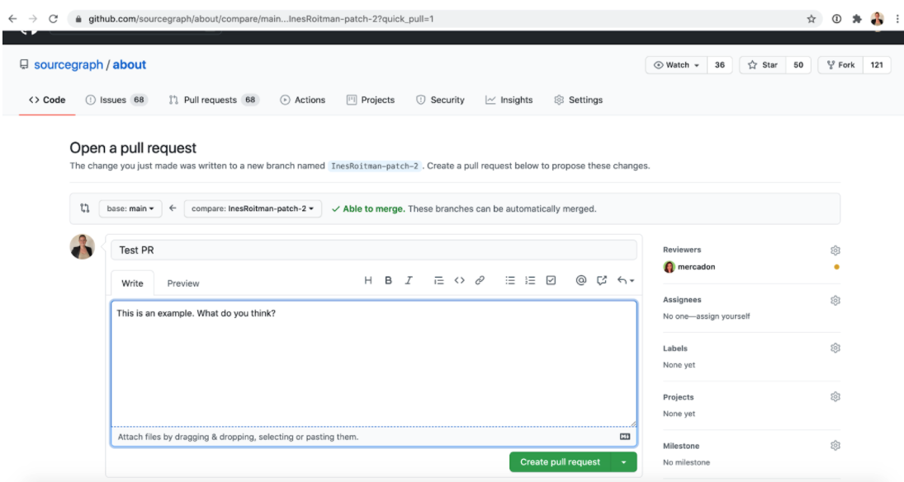
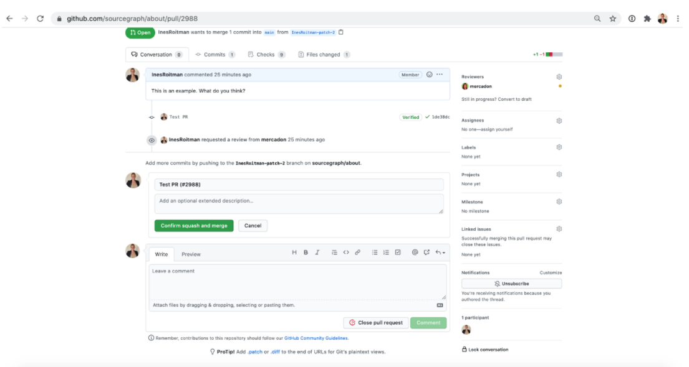

## How to edit the handbook

Take a look at this high-level tutorial on how to edit the handbook. Here you will learn about some common terms, steps and tips on how to edit the handbook.

<iframe src="https://drive.google.com/file/d/1SU0ACCm0dJZAK-OWxBqFeJvzvuwveZUT/preview" width="640" height="480" allow="autoplay"></iframe>

If you cannot see the preview of the video properly, you can watch it [here](https://drive.google.com/file/d/1SU0ACCm0dJZAK-OWxBqFeJvzvuwveZUT/view?usp=sharing)

You can also check out the steps here:

If you want to make a change in the handbook, do it by creating a pull request (proposing an edit to the handbook). 

Before diving into this let’s go through some vocabulary to understand what everything means.

- **Repository** 
 A collection of (usually related) source code and other files, plus the history of those files. It is a location for your project, similar to a Google Drive folder that stores related documents in one place.

- **Branch**
 A specific series of changes in a repository, usually used to isolate changes during their development. Branching lets you make changes, test them in a staging area, then merge them into the “main branch” (the “live” part of your code).

- **Main (sometimes referred to externally as “Master”) Branch**
 The primary/default branch of a repository, usually holding the actively-developed product and working on features (non-working versions tend to stay in branches). This is the “live” part of a project that can be viewed by the public.

To edit a page in the handbook, first you will need to accept GitHub’s email invite to the Sourcegraph org (you should be a member of the [Everyone group](https://github.com/orgs/sourcegraph/teams/everyone) in Sourcegraph’s GitHub organization). Contact Tech Ops if you are having issues with this.

Once this is done:

1. Visit the handbook page you want to edit on the handbook.
2. Press the *Edit this page* button in the sidebar

3. In the text editor, make your edits. 
The document is in a format called Markdown. It lets you use headings, links, bold, lists, etc., in a plain text file. You’ll have to follow certain guidelines if you want to format your text. For example, as you can see from the image below, adding a # before text will format it as a title. 
 

*Take a look at this [cheat-sheet](https://www.markdownguide.org/cheat-sheet/) that has the basics.* 
 
It is not always easy, especially in the beginning, to imagine how your edit is looking. You can click on the *Preview changes* tab on top of the text editor to preview how the changes will look:

4. Once you’ve finished making changes, you’ll have to commit the changes to a branch. 
First, write a small title to your commit on the *Update index.md* field. This title should describe your commit in a way that other teammates will easily know what this is about. For example, “Adding my bio to the handbook” or “Removing deprecated onboarding process”.

5. Now it’s the moment you commit your changes. There are two options:
- Commit the changes directly to the main branch

This adds your edits directly to the handbook. However, **you shouldn’t use this option.**

   - The correct way of doing it is by creating a new branch and starting a pull request. This means that you want someone to review your changes before adding everything to the main branch. To commit to a branch and open a PR, select “Create a new branch for this commit and start a pull request.” 

A pull request (PR) is when we request in GitHub for someone else to review our work for any possible errors or flaws before finalizing changes. For example, if you had written an article, and you were almost ready to publish it but first you want someone else to review it. They have the option to provide feedback through comments or approve it for publishing. Once a PR is opened, you can discuss and review the potential changes with collaborators and add follow-up commits before your changes are merged into the main branch. \

For example, if you want to make a change in the communication process between your team and another team, you should include teammates from both teams as reviewers. They will look at your proposed changes, comment on them, so you can make the appropriate changes and finally, when it’s approved, you’ll be able to merge it to the main branch. 

A commit is a single set of changes and a merge is the act of taking a series of commits in a branch and applying them to the existing repository. Generally, merging happens once your PR has been approved.

To finish opening the PR, click on *Propose changes*. 

6. Here you’ll be able to add comments to your pull request and choose the people you want to review your changes.

Click on *Reviewers* to the right and choose the people you want. 

Keep in mind that some edits don’t need reviewers, for example, editing a typo or adding yourself to the Team page. 

7. Click on *Create pull request*. 

8. You should wait for all the checks to pass. This means there are no issues or conflicts. If any of them don’t pass, you can ask anyone on the #handbook channel or tag @handbook-support for help on identifying them. 
 

You can click on the *Files changed* tab on the top to see the actual changes (called diffs). In red you’ll see what has been removed and in green everything that has been added: 

9. Once the PR has passed all checks, and if you assigned reviewers, once those reviewers have approved it, click on *Squash and merge* in the *Conversation* tab. 

10. And finally, click on *Confirm squash and merge*.

Merging your pull request, means that everything went well and you want the changes to be merged to the main branch. In about 5 minutes you’ll be able to see them live in the handbook.

Now that you know how to make a PR, watch [this video](https://youtu.be/MsIGvw0IEzo) of Quinn guiding you live on how to edit the handbook.

If you’ve asked someone to review your pull request, you’ll find some comments like these:

You will be able to resolve the conversation, edit the commit and then merge.

You can see [this short video](https://youtu.be/Q8tUXKU66Sk) that explains how comments are made.

Finally and most importantly, **changes are not permanent**, so don’t be afraid to edit the handbook. If you are not happy with something you’ve merged or made a mistake, we can roll it back! Just reach out to someone in the #handbook or #any-questions Slack channels and anyone will be happy to help.

Visit the handbook page on [editing the handbook](https://about.sourcegraph.com/handbook/editing) any time. You will find steps and videos that guide you through the process.

