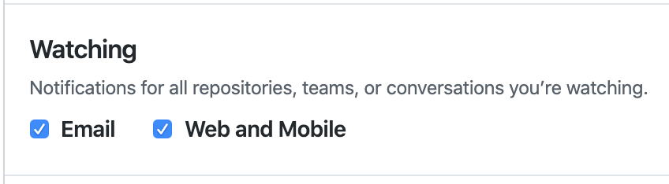
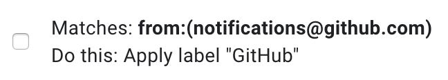

# GitHub notifications

It is important to configure your notifications correctly so that you receive and read notifications that are important (e.g. someone makes a comment on one of your PRs, someone adds you as a reviewer to a PR) without being overwhelmed by notifications that don't involve you. This document describes some options.

GitHub notification settings are configured here: https://github.com/settings/notifications.

## Custom routing

To keep your work notifications separate from your personal notifications, we recommend that you configure notifications for repositories in the Sourcegraph GitHub organization to be delivered to your sourcegraph.com email address.

## Participating

Everyone should have these notifications enabled so that you are notified when someone mentions or requests a review from you in a PR or issue.

## Watching

This option will send you the firehose of notifications for all of the repositories that you are watching (and by default this is all repositories in the Sourcegraph org when you join it). There are two reasons why you might want to do this:

1. So that you can search your email to find conversations that are not involved in.
2. So that if you are added to an existing conversation in a PR or issue, you will have the complete conversation in your email already.

If you enable email notifications for watched repositories then you will want to setup some email filters (otherwise your email inbox will be overwhelmed and important things will get buried). You should _not_ attempt to read every issue and PR that doesn't involve you.

### Gmail filters

1. Create a filter that skips the inbox for any message from notifications@github.com that doesn't contain your email address (i.e. `from:(notifications@github.com) -{YOURNAME@sourcegraph.com}`). GitHub will explicitly cc your email address if and only if you are mentioned/involved in the thread. Only threads that involve you will appear in your inbox.

    

2. Create a "GitHub" label for all notifications from GitHub (i.e. `from:(notifications@github.com)`). This allows you to browse threads that don't involve you (if you want).

    

💡When creating these filters, select "Also, apply filter to matching conversations".

### Slack Notifications

You may want to have Slack notify you in real-time when someone comments on your PR.

1. Add the GitHub App to Slack

2. Open a direct message with the app and type `/github settings` and follow the prompts to sign into GitHub.

3. Navigate to [https://github.com/settings/reminders/sourcegraph](https://github.com/settings/reminders/sourcegraph)

