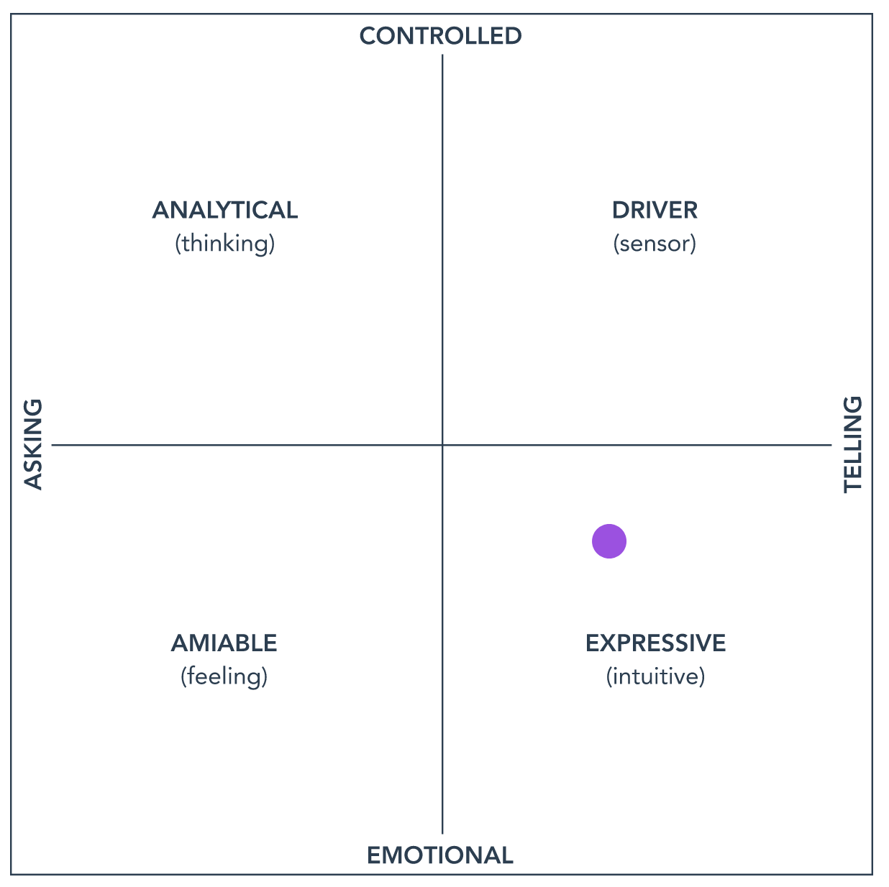

# Jason's README

Hello, I’m Jason Yavorska and I’m the Product Director for Code Graph. You can also see my [bio on the team page](../../../team/index.md#jason-yavorska) for more info about me.

## Logistics

- When managing Product Managers, I see myself in a coach/mentoring role with them with them as the visible experts. What I'll spend the rest of my time on is connecting dots (so I can inform my team), making sure we collaborate efficiently, and otherwise building/hiring a great group of people. This means that I'll typically work behind the scenes and avoid taking over; if you think it's helpful for me to do that in a specific situation, it's not a problem at all but please be direct and let me know.
- I tend to be good at unblocking, helping break down problems into iterations, and generally helping move things forward - let me know if I can ever help you.
- I always appreciate direct feedback, so don't worry about upsetting me and feel free to share bad news early.
- I'm more likely to be optimistic than not, with a plan that we'll figure it out what we need to when we need to, so feel free bring me back to reality.
- I tend to debate different perspectives to solve problems, including playing "Devil's Advocate". If that puts you off that's fine - just tell me and we’ll use another approach.

## Reference

These are some of my favorite product principles.

- I love thinking about technology, processes, personalities, and efficiency, but what really drives me is what Marc Andreessen described as [the one thing that matters](https://pmarchive.com/guide_to_startups_part4.html): the journey of finding and growing product market fit.
- I like to follow the [reasonable person principle](http://www.cs.cmu.edu/~weigand/staff/).
- I have learned that working on things [iteratively](https://about.gitlab.com/handbook/values/#iteration) tends to get the best results.
- Talking to customers in a way where they tell you the truth about what they actually are willing to pay for is a subtle skill. This [video](https://www.youtube.com/watch?v=MT4Ig2uqjTc) and [book](http://momtestbook.com/) can help you learn to do that better.

## Management Style

My own default approach to management is:

- Non-hierarchical: the best way to solve a conflict is by getting the people together who have the problem, rather than finding the common manager of them and having them make a decision. The people with the issue know the most about it and can make the best decision. One exception is conflicts of prioritization between teams, which I can help. If you’re used to more heirarchical structures, I can help you develop your skills on how to solve problems without escalating.
- Trust based: My direct reports are all in senior leadership roles so I won’t check in on you to make sure that your work is on track, that you are at your desk, and so on. My expectation is that you’ll raise any concerns that are relevant to me as needed, that you’re working towards results, and if you need any help (which I’m happy to provide!) you’ll let me know. If you are used to lower trust environments, please don’t mistake low micromanagement for not wanting to help.
- Servant leadership: I avoid making promises on your behalf, and give you the opportunity to speak for yourself for your area. In strategic MT discussions my task is to share any information you’ve shared with me, to take notes that I will share with you, and make connections where needed (for example, making introductions or giving heads ups if people are working on similar topics). My role as your coach is to help you improve in your leadership, decision making, and role-based skills. If you haven’t been point for your area before, you may need help with efficient organizational communication. I’d love to help you develop that skill.
- Team oriented: My main job is to create a great team, with great leaders, who make great decisions and excel at their jobs. It’s not for me to build a team of “assistants” who enable me to be able to know and do everything. That doesn’t scale, is demotivating, and creates a single point of failure for the company. If you are used to being more like an assistant to an MT member, it may feel uncomfortable to have your own visibility and accountability. Remember that I don’t expect perfection out of anyone, and I can help you learn to do this well.
- No ego: I won't defend a point to win an argument or double-down on a mistake. The illusion that everyone needs to prove their worth or be correct all the time fuels imposter syndrome and causes issues with mental health; instead we should endeavor to do the best we can with what we know at the time. Honest, direct feedback is always welcome and is always available. It’s also simply not possible to “step on my toes” at work. You can always come to me with your thoughts and opinions and we’ll work together, without blame or defensiveness, to handle them as best we can. You can definitely tell me directly when I’m wrong.

We can change any of the above approaches if they don’t work for you in general or for a specific situation. Lets talk about it in that case.

## Personal Style

My [Enneagram type is The Enthusiast](https://www.enneagraminstitute.com/type-7), and my StrengthsFinder types are 1. [Strategic](https://strengthsschool.com/strategic-strengthsfinder), 2. [Relator](https://strengthsschool.com/relator-strengthsfinder), 3. [Adaptability](https://strengthsschool.com/adaptability-strengthsfinder), 4. [Maximizer](https://strengthsschool.com/maximizer-strengthsfinder) and 5. [Futuristic](https://strengthsschool.com/futuristic-strengthsfinder).

For the Insights personality test, I’m a “Creative Directing Motivator”. I tend to have a creative and intuitive way of working, which works really well with iteration. It also means that I really enjoy sharing my enthusiasm and passion for the problems I am working on, and that I excel in unstructured, fast-moving environments. I'm motivated by being appreciated and working on innovative solutions. This also means as a negative that I can make mistakes or have frequent changes in direction or focus due to my inclination to act on opinions, hunches, and intuitions versus facts and data, and so I try to be careful to avoid this by working iteratively rather than via sweeping changes. A sample motto for an expressive manager like me might be "I lean on the power of my vision, and trust in my persuasive power."

Apart from this, I love coaching and developing people, and am a natural collaborator/facilitator. If there's ever anything where I can help in this regard, please just let me know.
